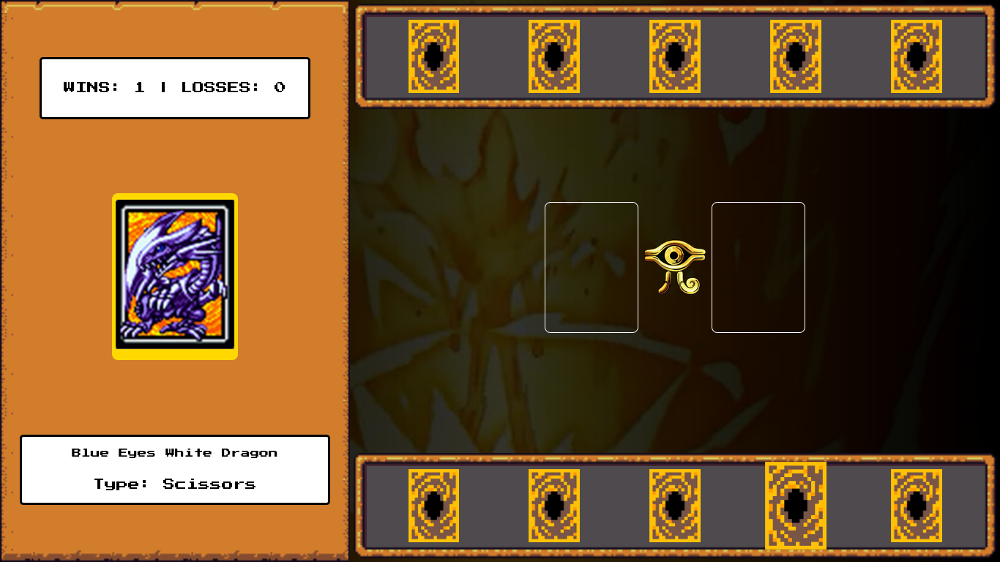

# RPS-YGO-DIO

OBS: Este repositório contém o código reproduzido por mim, com base na criação original da DIO. Em outras palavras o código original não é meu, e esta é uma replica produzida como projeto do Bootcamp de Desenvolvimento de Jogos da DIO, oferecido pela iFood.

A seguir segue uma paráfrase do README para outro projeto da DIO, sendo as modificações feitas com o objetivo de atender o conteúdo deste repositório.

---
##  Awesome JSGame Yu-Gi-Oh RPS

  

Bem-vindo ao **JSGame Yu-Gi-Oh RPS**! Neste repositório, você encontrará um jogo de Pedra-Papel-Tesoura, com a temática baseada no mangá/anime/jogo Yu-Gi-Oh!. Este projeto não apenas oferece entretenimento, mas também demonstra várias técnicas avançadas de desenvolvimento de jogos em JavaScript.

### Tecnologias Utilizadas

- HTML5 e CSS3 para a estrutura e aparência do jogo.
- JavaScript para a lógica de programação e interatividade.

### Como Jogar

1. Clone este repositório para sua máquina local.
2. Abra o arquivo `index.html` em seu navegador web.
3. Use o Mouse para interagir.
4. Divirta-se!

### Contribuição

Contribuições são bem-vindas! Se você deseja melhorar este jogo, adicionar novos recursos ou corrigir problemas, sinta-se à vontade para abrir um _pull request_.

### Créditos

Este jogo foi desenvolvido como parte de um projeto educacional da Digital Innovation One.

---

Divirta-se jogando o **JSGame Yu-Gi-Oh RPS** enquanto explora as técnicas modernas de desenvolvimento de jogos em JavaScript. Lembre-se de conferir o repositório original com os assets usados neste projeto [aqui](https://github.com/digitalinnovationone/js-yugioh-assets) e deixar uma ⭐️ se você gostou do projeto!