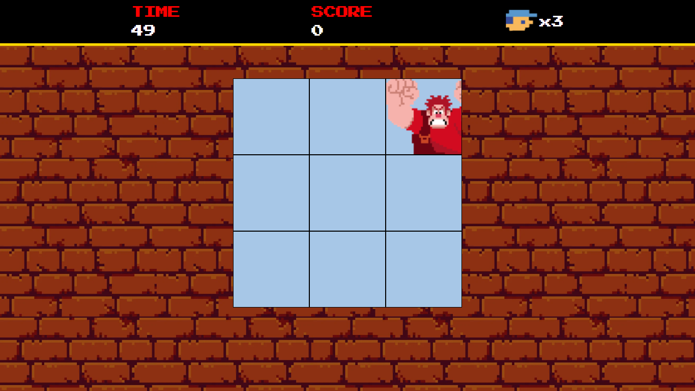

# Wreck-it-Ralph-DIO

OBS: Este repositório contém o código reproduzido por mim, com base na criação original da DIO. Em outras palavras o código original não é meu, e esta é uma replica produzida como projeto do Bootcamp de Desenvolvimento de Jogos da DIO, oferecido pela iFood. Apesar do que está declarado no 3° ponto, o jogo é do tipo Clicker, então a interação com o mesmo é a partir do Mouse.

A seguir, será apresentado o README do repositório original.

---
## Awesome JSGame Detona Ralph

  

Bem-vindo ao **JSGame Detona Ralph**! Neste repositório, você encontrará um jogo divertido baseado no famoso filme "Detona Ralph". Este projeto não apenas oferece entretenimento, mas também demonstra várias técnicas avançadas de desenvolvimento de jogos em JavaScript.

### Tecnologias Utilizadas

- HTML5 e CSS3 para a estrutura e aparência do jogo.
- JavaScript para a lógica de programação e interatividade.
- Sprites e imagens customizadas para criar a estética única do universo de Detona Ralph.

### Funcionalidades Incríveis

- **Sistema de Pontuação**: Acompanhe sua pontuação à medida que progride no jogo e desafie seus amigos a superá-la, clique no quadrado que o Ralph se encontre

### Como Jogar

1. Clone este repositório para sua máquina local.
2. Abra o arquivo `index.html` em seu navegador web.
3. Use as setas direcionais para mover o personagem e a barra de espaço para interagir.
4. Divirta-se explorando e coletando moedas, mas fique atento aos inimigos!

### Contribuição

Contribuições são bem-vindas! Se você deseja melhorar este jogo, adicionar novos recursos ou corrigir problemas, sinta-se à vontade para abrir um _pull request_.

### Créditos

Este jogo foi desenvolvido como parte de um projeto educacional da Digital Innovation One.

---

Divirta-se jogando o **JSGame Detona Ralph** enquanto explora as técnicas modernas de desenvolvimento de jogos em JavaScript. Lembre-se de conferir o repositório original [aqui](https://github.com/digitalinnovationone/jsgame-detona-ralph) e deixar uma ⭐️ se você gostou do projeto!
